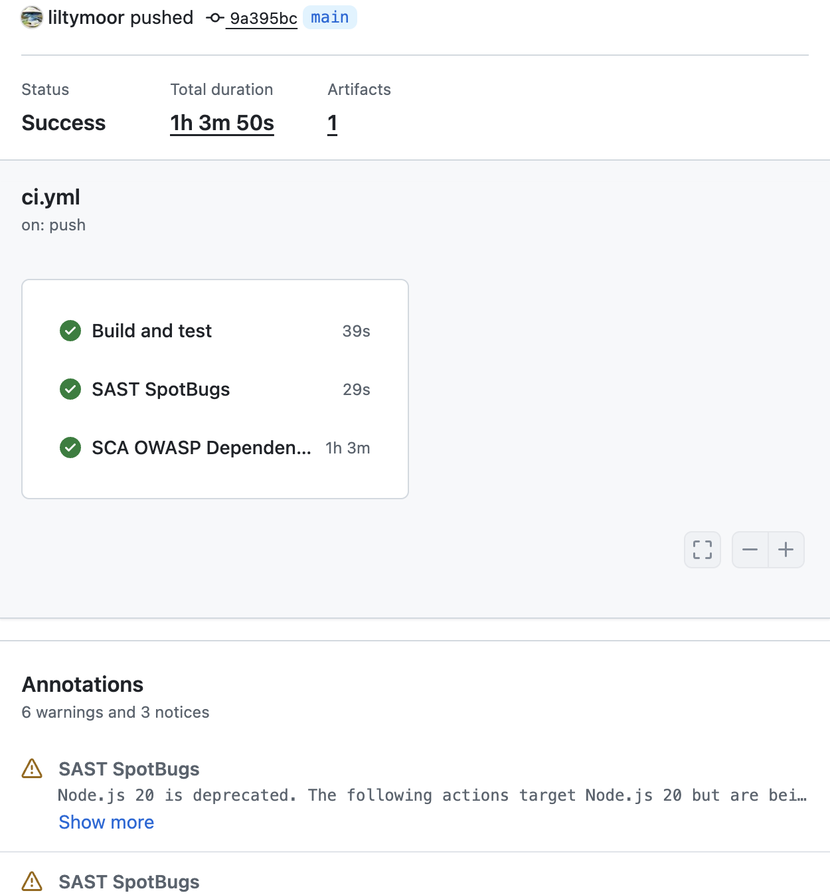
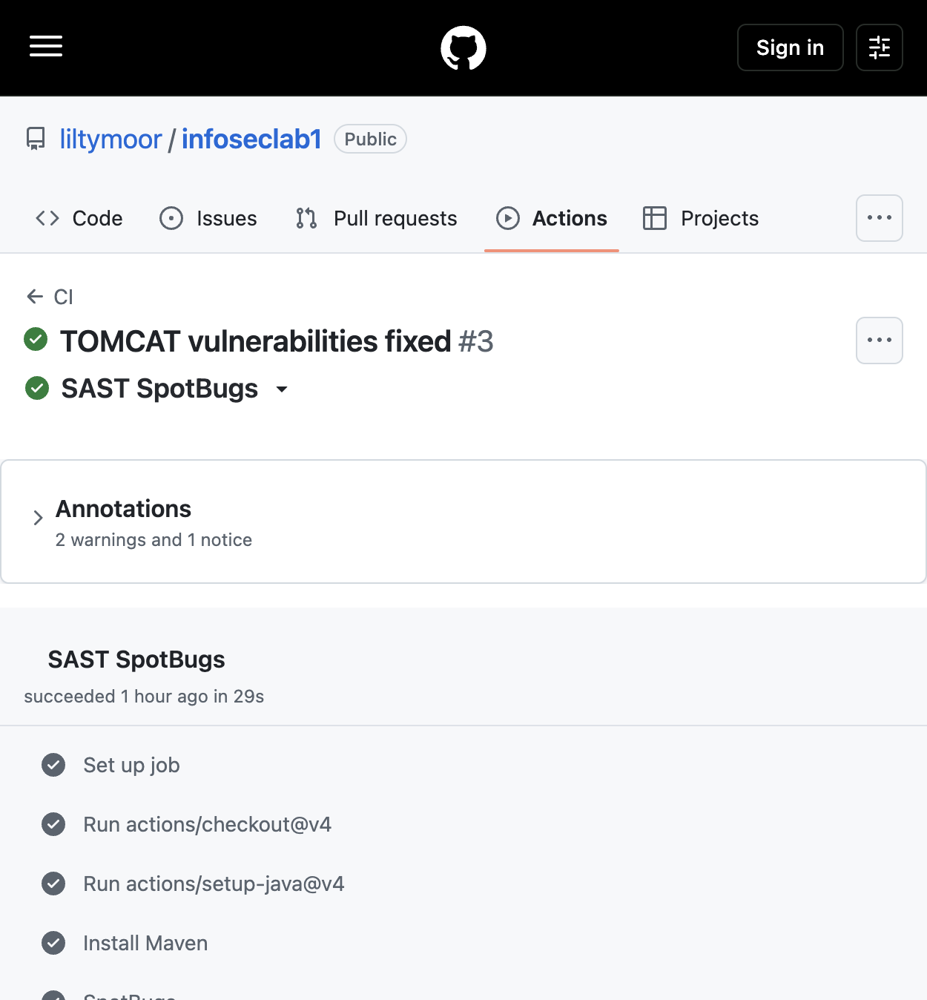
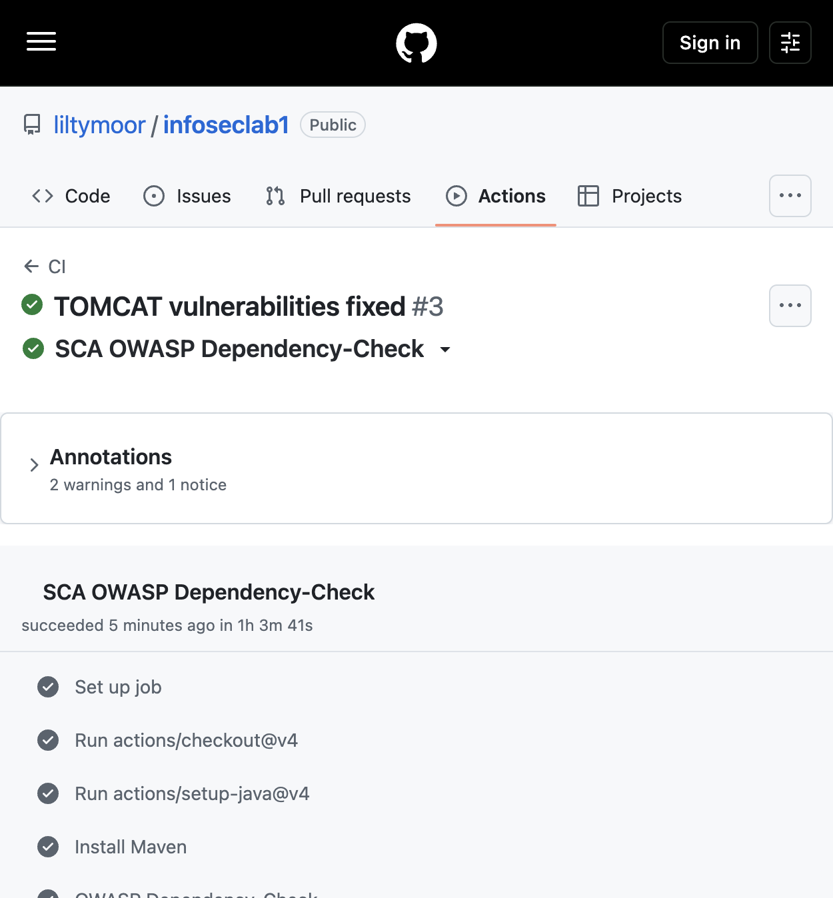

# info-sec-lab1

Spring Boot API (Java 21): аутентификация по JWT, защищённая работа с постами, защита от SQL Injection и XSS, плюс SAST/SCA в GitHub Actions.

Стек: Spring Web MVC, Spring Security, Spring Data JPA, PostgreSQL, JWT (jjwt), Docker Compose.

## Запуск

1. Заполните `.env` (URL/логин/пароль БД, `JWT_SECRET`, демо-пользователь).
2. Поднимите PostgreSQL и приложение:

```bash
docker compose up -d
./mvnw spring-boot:run
```

API слушает `http://localhost:8080`. Для запросов есть Postman-коллекция в `postman/collections/info-sec-lab1/`.

---

## Описание API

Все ответы — JSON. Защищённые эндпоинты требуют заголовок:

```http
Authorization: Bearer <jwt>
```

### `POST /auth/register`

Регистрация. Пароль хешируется BCrypt, в ответе сразу выдаётся JWT.

**Тело запроса:**

```json
{
  "login": "student",
  "pass": "StrongPass1"
}
```

**Успех (200):**

```json
{ "token": "<jwt>" }
```

| Код | Когда |
|-----|--------|
| 400 | пустые `login` / `pass` |
| 409 | логин уже занят |

**Пример:**

```bash
curl -s -X POST http://localhost:8080/auth/register \
  -H 'Content-Type: application/json' \
  -d '{"login":"student","pass":"StrongPass1"}'
```

### `POST /auth/login`

Вход через Spring `AuthenticationManager` (проверка логина/пароля), затем выпуск JWT.

**Тело запроса:** то же, что у register (`login`, `pass`).

**Успех (200):**

```json
{ "token": "<jwt>" }
```

| Код | Когда |
|-----|--------|
| 400 | пустые credentials |
| 401 | неверный логин/пароль (в т.ч. попытка SQLi) |

**Пример:**

```bash
curl -s -X POST http://localhost:8080/auth/login \
  -H 'Content-Type: application/json' \
  -d '{"login":"demo","pass":"demo-password"}'
```

### `GET /api/data`

Список постов. Требует JWT. Поля `title`, `body`, `author` отдаются HTML-экранированными (защита от XSS).

**Успех (200):**

```json
[
  {
    "id": "…",
    "title": "…",
    "body": "…",
    "author": "…"
  }
]
```

| Код | Когда |
|-----|--------|
| 401 | нет/невалидный токен |

**Пример:**

```bash
curl -s http://localhost:8080/api/data \
  -H "Authorization: Bearer $TOKEN"
```

### `POST /api/posts`

Создание поста от имени пользователя из JWT. Требует JWT.

**Тело запроса:**

```json
{
  "title": "Заголовок",
  "body": "Текст поста"
}
```

**Успех (201):** объект поста (с экранированием HTML в ответе).

| Код | Когда |
|-----|--------|
| 400 | пустые `title` / `body` |
| 401 | нет/невалидный токен |

**Пример:**

```bash
curl -s -X POST http://localhost:8080/api/posts \
  -H 'Content-Type: application/json' \
  -H "Authorization: Bearer $TOKEN" \
  -d '{"title":"Hello","body":"World"}'
```

---

## Меры защиты

### Защита от SQL Injection

1. **Нет конкатенации SQL.** Доступ к данным только через Spring Data JPA / Hibernate.
2. **Параметризованные JPQL-запросы.** Поиск пользователя:

```java
@Query("select u from LabUser u where u.username = :username")
Optional<LabUser> findByUsername(@Param("username") String username);
```

Параметр `:username` передаётся как bind-параметр драйвера, а не вставляется в строку запроса. Попытка вроде `' OR 1=1 --` становится обычным значением username и не меняет логику SQL — login возвращает `401`.
3. **Derived query methods** (`existsByUsername`, `findAllByOrderByCreatedAtAsc`) тоже генерируют параметризованный SQL.
4. **Аутентификация не через «сырой» SQL.** Login идёт через `AuthenticationManager` + `UserDetailsService`, сравнение пароля — BCrypt, а не SQL-условие вида `password = …`.

### Защита от XSS

1. **Экранирование на выводе.** Перед отдачей клиенту поля поста проходят через `OutputSanitizer.escape()` (`HtmlUtils.htmlEscape`): `<`, `>`, `"`, `'`, `&` превращаются в HTML-сущности.
2. **Хранение vs отображение.** В БД может лежать сырой текст (в т.ч. `<script>…</script>`), но в JSON API он уже безопасен для вставки в HTML-контекст.
3. **Проверка в Postman.** Запрос `create-post` отправляет XSS-payload и проверяет, что в ответе нет сырых тегов, а есть `&lt;script&gt;`.

Пример: вход `<script>alert(1)</script>` → в ответе `&lt;script&gt;alert(1)&lt;/script&gt;`.

### Аутентификация и авторизация

1. **Регистрация / логин** — публичные `POST /auth/register`, `POST /auth/login`; остальное (`/api/**` и прочее) требует аутентификации (`SecurityConfig`).
2. **Пароли** хранятся только как BCrypt-хеш (`BCryptPasswordEncoder`), plaintext в БД не пишется.
3. **JWT (HS256):**
   - подпись секретом `jwt.secret` (из окружения);
   - claims: `sub` (username), `role`, `iss`, `iat`, `exp`;
   - срок жизни задаётся `jwt.expiration-ms` (по умолчанию 1 час);
   - при разборе проверяются подпись, issuer и expiration.
4. **`JwtAuthFilter`** читает `Authorization: Bearer …`, валидирует токен и кладёт `UsernamePasswordAuthenticationToken` в `SecurityContext`.
5. **Stateless-сессии:** `SessionCreationPolicy.STATELESS`, form-login и HTTP Basic отключены.
6. **Без токена** защищённые эндпоинты отвечают `401` и телом `{"error":"unauthorized"}`.

---

## SAST / SCA в CI/CD

Workflow `.github/workflows/ci.yml` на каждый push/PR запускает три job’а:

| Job | Инструмент | Назначение |
|-----|------------|------------|
| Build and test | `mvn verify` | сборка и тесты |
| **SAST SpotBugs** | `spotbugs-maven-plugin` | статический анализ bytecode (баги / security smells) |
| **SCA OWASP Dependency-Check** | `dependency-check-maven` | уязвимости в зависимостях (CVE); HTML/JSON-отчёт как artifact |

### Скриншоты из GitHub Actions

Прогон [CI #3](https://github.com/liltymoor/infoseclab1/actions/runs/36718631031) (`main`, Success): Build and test, **SAST SpotBugs**, **SCA OWASP Dependency-Check**.

#### Обзор CI (все job’ы SAST/SCA)



#### SAST: SpotBugs



#### SCA: OWASP Dependency-Check



Отчёт SCA дополнительно сохраняется артефактом `dependency-check-report` (`target/dependency-check-report.html` / `.json`) и доступен во вкладке Artifacts того же run.

Локально:

```bash
./mvnw -B spotbugs:check
./mvnw -B org.owasp:dependency-check-maven:check
```
